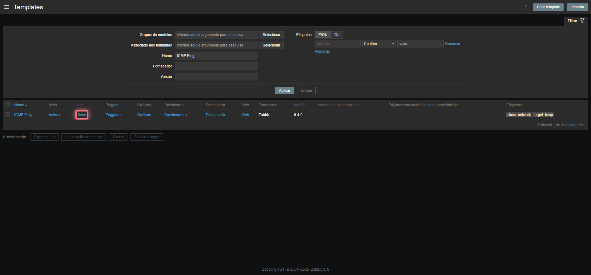
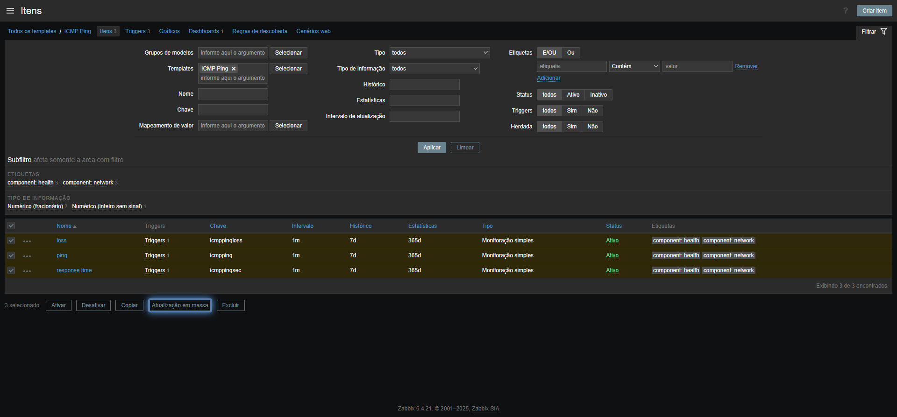
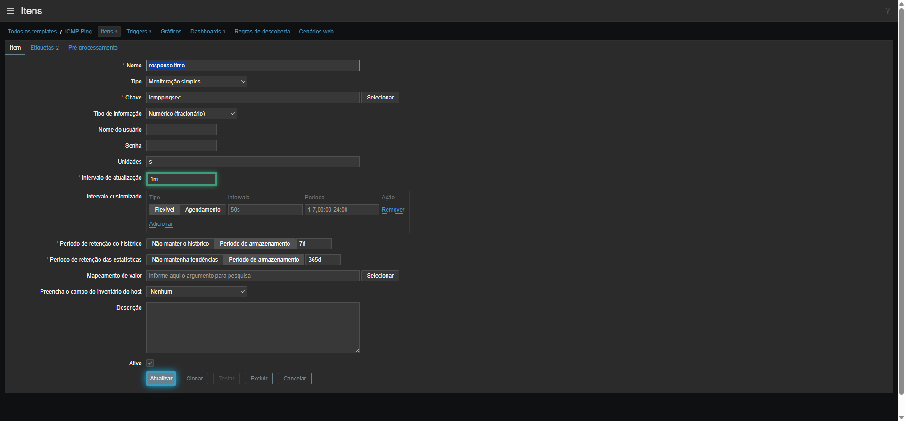

# Guia Prático: Otimização de Coleta no Zabbix para o NOC

Este tutorial passo a passo ajudará a equipe de T.I. da **Camilo dos Santos** a ajustar a frequência de coleta física dos roteadores e impressoras diretamente no Zabbix. Com essas pequenas mudanças de configuração no Zabbix, os gráficos, picos de tráfego, quedas e alertas no portal do NOC se tornarão extremamente responsivos e em tempo real.

---

## 📋 Resumo Técnico dos Tempos Recomendados

Para manter o painel dinâmico sem sobrecarregar o Zabbix, recomendamos os seguintes intervalos de atualização:

| Categoria do Ativo | Item do Zabbix (Métrica) | Intervalo Padrão | Intervalo Recomendado para NOC | Impacto Operacional |
| :--- | :--- | :--- | :--- | :--- |
| **Links WAN** | `ICMP ping` (Ping) | `1m` | **`15s` a `30s`** | Detecção de quedas e alertas no Telegram em menos de 30 segundos. |
| **Links WAN** | `ICMP response time` (Latência) | `1m` | **`15s` a `30s`** | Gráficos de latência ultra fluidos e precisão exata de picos. |
| **Tráfego WAN** | `Bits received / sent` (Banda) | `5m` | **`30s` a `1m`** | Leitura exata da saturação de download/upload e gráficos contínuos. |
| **Impressoras** | `Toner / Coletor level` | `1h` a `10m` | **`3m` a `5m`** | Captura e alerta de trocas de suprimentos rápidas sem gerar spam. |
| **Impressoras** | `Black / Color Counters` (Total) | `1h` | **`5m` a `10m`** | Atualização ágil de páginas rodadas para relatórios e faturamento. |

---

## 🛠️ Passo a Passo: Ajustando os Intervalos de Atualização (Templates)

Para não ter que alterar dispositivo por dispositivo, o Zabbix permite que façamos a alteração uma única vez no **Template**, aplicando-a automaticamente a todos os hosts que usam esse padrão.

### Passo 1: Localizar o Template de Conectividade
1. Acesse o painel web do seu Zabbix com uma conta administradora.
2. No menu lateral esquerdo, navegue até **Configuração (Configuration)** ➔ **Templates**.
3. No campo de busca superior, busque pelos templates que já estão criados no seu servidor:
   - `ICMP Ping` (Usado para status de ping e latência geral).
   - `Network Generic Device by SNMP` (Usado para tráfego e velocidade de rede genérico).
   - `Draytek SNMPv2` (Template específico para os seus roteadores DrayTek).
   - `Printer Toner CMYK SNMP` (Template específico para o nível de toner das impressoras).
4. Clique no link **Itens (Items)** na linha do template localizado.

### Passo 2: Alterar o Intervalo de Atualização (Update Interval)
1. Na lista de itens do template, encontre o item que deseja acelerar (ex: `ICMP response time` ou `Interface: Bits received`).
2. Clique diretamente no **nome do item** para abrir a tela de edição.
3. Localize o campo **Intervalo de atualização (Update interval)**.
4. Altere o valor padrão (ex: `1m` para 1 minuto, `5m` para 5 minutos) para o tempo recomendado (ex: **`30s`** para 30 segundos, ou **`15s`** para 15 segundos).
5. Clique no botão azul **Atualizar (Update)** na parte inferior da tela.

> [!TIP]
> **Edição em Lote (Mass Update):**
> Caso queira alterar vários itens do mesmo template de uma vez:
> 1. Marque a caixinha de seleção ao lado de todos os itens desejados na lista.
> 2. Role até o rodapé e clique em **Atualizar em lote (Mass update)**.
> 3. Marque a caixinha ao lado de **Intervalo de atualização (Update interval)**, defina o tempo (ex: `30s`) e clique em salvar!

### 📸 Guia Visual do Passo a Passo nos Templates
Aqui estão as capturas de tela demonstrativas de cada uma das etapas para ajudá-lo de forma visual:

1. **Passo 1: Localizar e Acessar os Itens**
   
   *Pesquise pelo template e clique no link de "Itens" na linha dele.*

2. **Passo 2: Seleção em Lote (Opcional)**
   
   *Marque as caixas dos itens que deseja alterar simultaneamente e clique em "Atualizar em lote" no rodapé.*

3. **Passo 3: Alterar o Tempo e Salvar**
   
   *Digite o novo valor no campo "Intervalo de atualização" (ex: `15s` ou `30s`) e clique no botão azul "Atualizar" no final.*


---

## 🚪 Passo 3: Garantindo o Cadastro de Dados Especiais (Serial e Banda)

Para evitar que o painel do NOC exiba **`N/D`** (Não Disponível) em dados cruciais, certifique-se de que os itens do Zabbix estejam nomeados exatamente como mapeado pelo backend:

### 1. Para o Número de Série (Impressoras)
* O NOC busca por itens de inventário do Zabbix que tenham as palavras: **`Número de série`**, **`Serial Number`** ou a chave SNMP `sysName` / inventário de serial ativo.
* **Ajuste:** Certifique-se de que a leitura SNMP correspondente ao serial esteja habilitada no Zabbix e que a aba *Inventário (Inventory)* do host esteja em modo **Automático** ou com o campo de Serial Number preenchido.

### 2. Para a Banda Contratada (Links WAN)
* O NOC calcula a porcentagem de banda usada baseando-se no item de **Velocidade de Interface (Interface speed)** do Zabbix.
* **Ajuste:** Garanta que a velocidade nominal contratada da interface do link (ex: 20 Mbps, 100 Mbps) esteja registrada corretamente na chave SNMP `ifSpeed` do Zabbix.
* *Nota:* Caso queira definir a velocidade manualmente de forma fácil sem mexer no Zabbix, você pode cadastrá-la na aba de **Limites** do painel do seu NOC, definindo um alias ou velocidade estática!

---

## ⚠️ Atenção: Evitando Filas e Sobrecargas (Zabbix Queue)

Quando diminuímos muito os tempos de coleta física no Zabbix, o servidor precisa trabalhar mais. Para garantir a integridade do seu servidor Zabbix:

1. **Acompanhe a Fila (Queue) do Zabbix**:
   - Acesse: **Administração (Administration)** ➔ **Fila (Queue)**.
   - Veja a tabela de atrasos. Todos os itens devem estar na coluna de **atraso inferior a 5 segundos (verde)**. Se houver muitos itens em vermelho (atrasados por minutos), significa que o Zabbix está sem "braço" para coletar tudo tão rápido.
   
2. **Como Resolver Atrasos (Zabbix Server Config)**:
   - Caso note lentidão na fila, acesse o terminal do seu servidor Zabbix e edite o arquivo de configuração do serviço: `sudo nano /etc/zabbix/zabbix_server.conf`.
   - Aumente o número de coletores simultâneos descomentando e alterando estas linhas:
     ```bash
     StartPollers=30      # Coletores SNMP e agentes (Padrão: 5)
     StartPingers=20      # Coletores de Ping/ICMP (Padrão: 1)
     ```
   - Salve o arquivo e reinicie o serviço do Zabbix: `sudo systemctl restart zabbix-server`. Isso dará "superpoderes" ao Zabbix para lidar com as coletas de 15 segundos sem atrasar absolutamente nada!
